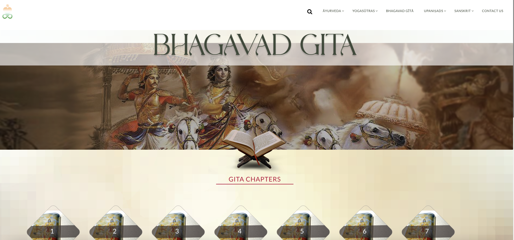
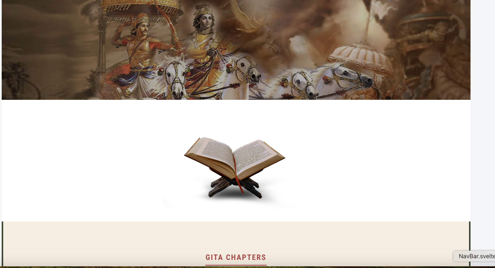
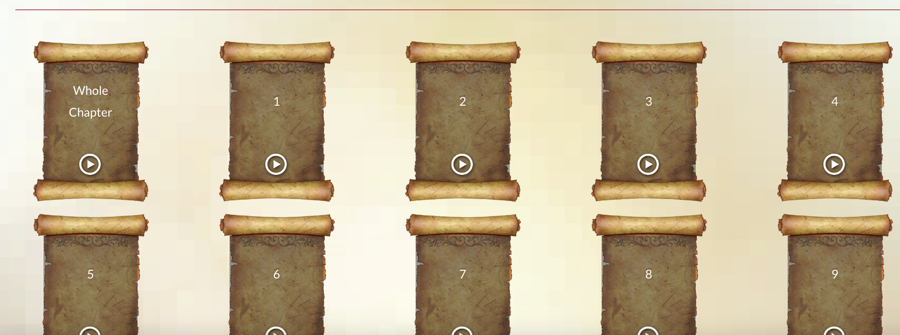
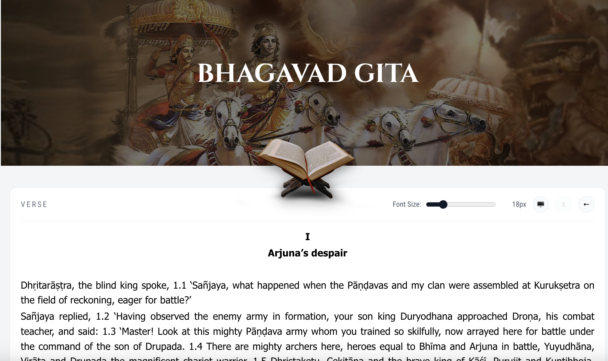
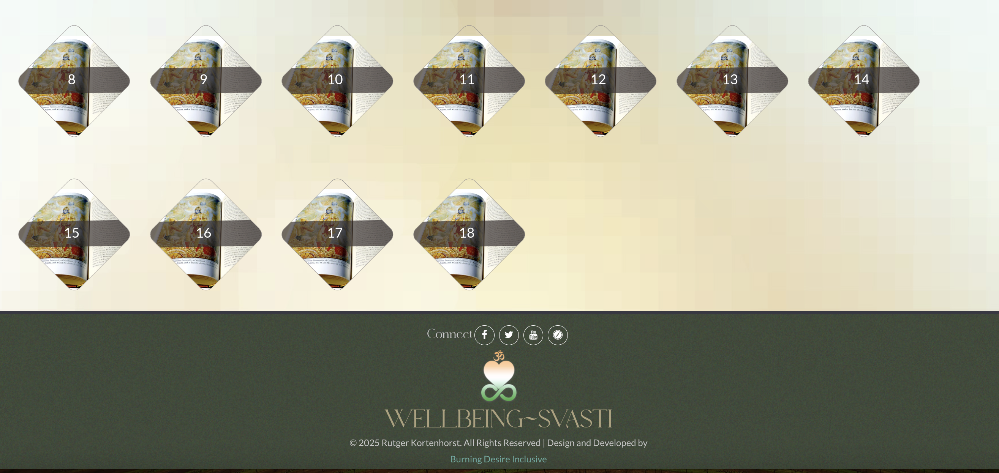
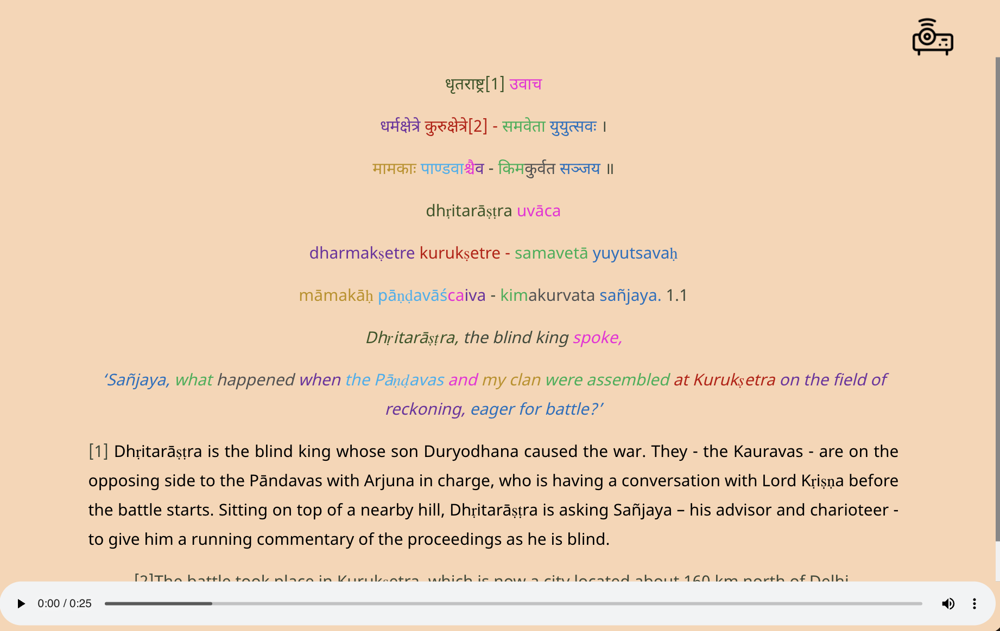
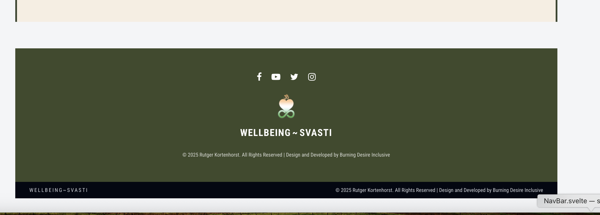

# 📚 Bhagavad Gita Web — Svelte Recreation

<div align="center">

**A faithfully recreated version of the Bhagavad Gita page from [sanskrit.ie](https://www.sanskrit.ie/gita.php), built with modern web technologies.**

[](https://svelte.dev/)
[](https://vitejs.dev/)
[](LICENSE)

</div>

---


## 🎨 UI Comparison Screenshots

### 🕉 Hero Section
Original:

Recreated:


### 📚 Gita Chapters Grid
Original:

Recreated:


### 📜 Verse Page
Original:

Recreated:


### 🧘 Footer
Original:

Recreated:


## ✨ Features

- ✅ **Pixel-Perfect UI Recreation** - Faithfully recreated layout matching the original design
- ✅ **Live API Integration** - Real-time verse data from Sanskrit.ie API
- ✅ **18 Chapter Grid** - Interactive diamond-shaped chapter cards with hover effects
- ✅ **Verse Reader** - Complete verse display with Sanskrit, transliteration, and translation
- ✅ **Audio Playback** - Integrated audio support for verse recitation
- ✅ **Font Size Control** - Adjustable text size (12px - 28px) for comfortable reading
- ✅ **Projector Mode** - Presentation-friendly reading interface
- ✅ **Responsive Design** - Seamless experience across mobile, tablet, and desktop
- ✅ **Smooth Navigation** - Intuitive UX with scroll-to-top on chapter load


## 🛠 Tech Stack

| Layer | Technology |
|-------|-----------|
| **Frontend** | Svelte + Vite |
| **Styling** | Custom CSS with responsive design |
| **Data Source** | Sanskrit.ie Geeta API |
| **State Management** | Svelte Stores |
| **Build Tool** | Vite |
| **Deployment** | Vercel / Netlify compatible |

---

## 📂 Project Structure

```
bhagavad-gita-svelte/
│
├── src/
│   ├── assets/
│   │   ├── gita_book.png          # Book image for hero section
│   │   ├── gita_banner.png        # Arjuna-Krishna chariot banner
│   │   └── chapter_images/        # Chapter background images
│   │
│   ├── components/
│   │   ├── NavBar.svelte          # Top navigation bar
│   │   ├── Hero.svelte            # Hero section with banner
│   │   ├── ChapterGrid.svelte     # 18-chapter diamond grid
│   │   ├── ChapterSidebar.svelte  # Verse navigation sidebar
│   │   ├── VerseList.svelte       # Main verse display component
│   │   ├── Footer.svelte          # Footer with credits
│   │   └── BottomBar.svelte       # Audio chapter selector
│   │
│   ├── lib/
│   │   ├── api.js                 # API integration functions
│   │   └── stores.js              # Svelte stores for state
│   │
│   ├── App.svelte                 # Main app component
│   └── main.js                    # App entry point
│
├── screenshots/                   # Application screenshots for README
│   ├── page1original.png         # Original website - hero section
│   ├── page1created.png          # Recreated - hero section
│   ├── page2original.png         # Original website - chapter grid
│   ├── page2created.png          # Recreated - chapter grid
│   ├── page3original.png         # Original website - verse reader
│   └── pagecreated-3.png         # Recreated - verse reader
│
├── public/                        # Static assets
├── package.json
├── vite.config.js
└── README.md
```

---

## 🚀 Getting Started

### 📋 Prerequisites

- Node.js (v16 or higher)
- npm or yarn
- Modern web browser

### 🔧 Installation

```bash
# Clone the repository
git clone https://github.com/<your-username>/bhagavad-gita-svelte.git

# Navigate to project directory
cd bhagavad-gita-svelte

# Install dependencies
npm install
```

### 🏃 Running Locally

```bash
# Start development server
npm run dev
```

The application will be available at **http://localhost:5173**

### 🏗️ Build for Production

```bash
# Create optimized production build
npm run build

# Preview production build
npm run preview
```

The production files will be generated in the `dist/` directory.

---

## 🔌 API Integration

The application fetches data from the Sanskrit.ie Geeta API:

```
https://www.sanskrit.ie/api/geeta.php?q=<chapter_number>
```

### API Response Structure

```javascript
{
  "chapter": 1,
  "title": "Arjuna Vishada Yoga",
  "verses": [
    {
      "verse": 1,
      "sanskrit": "धृतराष्ट्र उवाच...",
      "transliteration": "dhṛtarāṣṭra uvāca...",
      "translation": "Dhritarashtra said...",
      "commentary": "...",
      "audio_url": "..."
    }
  ]
}
```

### Example API Call

```javascript
// Fetch Chapter 1
const response = await fetch('https://www.sanskrit.ie/api/geeta.php?q=1');
const data = await response.json();
console.log(data.verses); // Array of verses
```

⚠️ **Note:** The API may occasionally be slow or temporarily unavailable.

---

## 🎨 Key Components

### Hero Section
The top banner features the iconic scene of Arjuna and Krishna on the battlefield, with an open book symbolizing the Gita's 18 chapters displayed below.

### Chapter Grid
18 interactive chapter cards arranged in a responsive grid. Each card displays:
- Chapter number
- Diamond-shaped design with background imagery
- Hover effects for visual feedback
- Click to load chapter verses

### Verse Display Interface
Rich verse reading experience with:
- **Sanskrit Text:** Original Devanagari script
- **Transliteration:** IAST romanization for pronunciation
- **Translation:** English interpretation
- **Font Controls:** Slider to adjust text size (12-28px)
- **Projector Mode:** Simplified view for presentations
- **Navigation:** Previous/Next verse buttons
- **Audio Player:** Verse recitation playback

### Audio Chapter Selector
Scroll-style interface displaying all 18 chapters as ancient manuscript scrolls, each with a play button for chapter audio recitation.

---

## 📱 Responsive Design

The application adapts seamlessly to different screen sizes:

- **Mobile** (320px - 767px): Stacked layout, touch-optimized controls
- **Tablet** (768px - 1023px): Grid adjustments, balanced spacing
- **Desktop** (1024px - 1439px): Full grid display, enhanced visuals
- **Large Screens** (1440px+): Maximized reading experience

---

## 🌍 Deployment

### Deploy to Vercel

```bash
# Install Vercel CLI
npm i -g vercel

# Deploy
vercel
```

Or connect your GitHub repository to Vercel for automatic deployments.

### Deploy to Netlify

```bash
# Build the project
npm run build

# Deploy using Netlify CLI
npm i -g netlify-cli
netlify deploy --prod --dir=dist
```

Or drag and drop the `dist` folder to the Netlify dashboard.

---

## 🎓 Features Breakdown

### Navigation
- Smooth scrolling between sections
- Sticky navigation bar
- Quick chapter access from any page
- Breadcrumb navigation for verses

### Reading Experience
- Clean, distraction-free verse display
- Multiple text representations (Sanskrit, transliteration, translation)
- Customizable font sizing
- Audio synchronization with text
- Verse-by-verse navigation

### Performance
- Fast initial load with Vite
- Lazy loading of chapter data
- Optimized images and assets
- Efficient state management
- Minimal re-renders with Svelte

---

## 🙏 Acknowledgments

- **Original Source:** [sanskrit.ie](https://www.sanskrit.ie/) for the API and design inspiration
- **Sacred Text:** The Bhagavad Gita, ancient spiritual wisdom
- **Design & Development:** Recreated by Rutger Kortenhorst | Burning Desire Inclusive
- **Purpose:** Created as part of an internship evaluation to demonstrate web development skills

---

## 📜 License

This project is licensed under the MIT License - see the [LICENSE](LICENSE) file for details.

---

## 🔮 Future Enhancements

Potential features for future versions:

- [ ] Chapter summaries and themes
- [ ] Verse bookmarking and favorites
- [ ] Search functionality across all verses
- [ ] Multiple translation sources
- [ ] Dark mode theme toggle
- [ ] Progressive Web App (PWA) capabilities
- [ ] Offline mode with cached data
- [ ] Commentary from various scholars
- [ ] Verse sharing on social media
- [ ] Reading progress tracking

---

## 📧 Contact

**Developer:** [Your Name]  
**Email:** your.email@example.com  
**GitHub:** [@your-username](https://github.com/your-username)  
**LinkedIn:** [Your LinkedIn Profile](https://linkedin.com/in/your-profile)

---

## 🐛 Bug Reports & Feature Requests

Found a bug or have a feature request? Please open an issue on the [GitHub repository](https://github.com/your-username/bhagavad-gita-svelte/issues).

---

## 🤝 Contributing

Contributions are welcome! Please feel free to submit a Pull Request. For major changes, please open an issue first to discuss what you would like to change.

---

<div align="center">

**Made with ❤️ and devotion to preserving ancient wisdom through modern technology**

⭐ Star this repository if you found it helpful!

[View Demo](https://your-demo-url.com) • [Report Bug](https://github.com/your-username/bhagavad-gita-svelte/issues) • [Request Feature](https://github.com/your-username/bhagavad-gita-svelte/issues)

</div>
